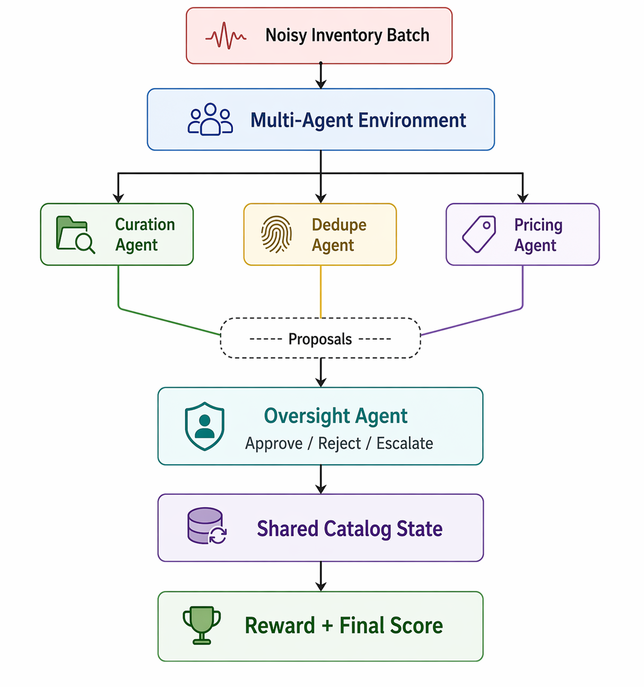
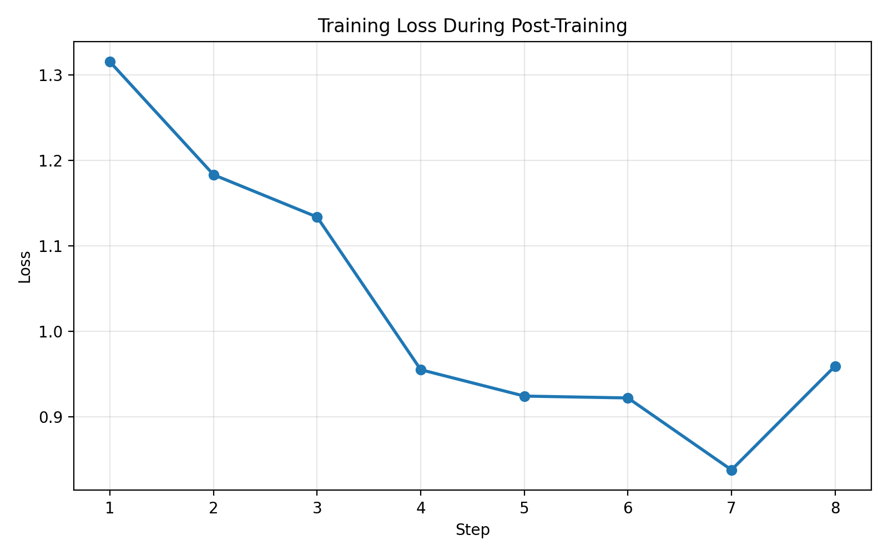
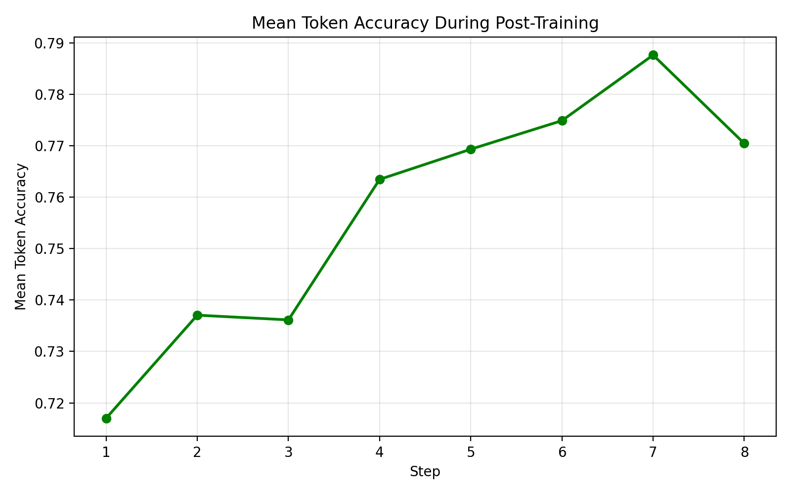
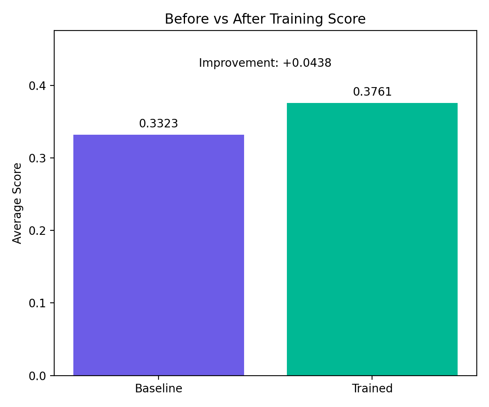

# Multi-Agent Hyperlocal Catalog Ops

Multi-Agent Hyperlocal Catalog Ops is an OpenEnv benchmark for quick-commerce inventory curation. It is designed for the **Multi-Agent Interactions** theme and models a realistic enterprise workflow where multiple specialized agents coordinate under oversight.

## Summary

This benchmark focuses on **safe multi-agent decision-making** in hyperlocal quick-commerce operations. It combines:
- a realistic enterprise workflow
- structured multi-agent coordination
- programmatic reward design
- post-training readiness
- measurable improvement after training

After post-training, the benchmark score improved from **`0.3323`** to **`0.3761`**, showing a clear before-vs-after gain from training the `oversight_agent`.

## Links

- Hugging Face Space: [Multi-Agent Hyperlocal Catalog Ops](https://huggingface.co/spaces/MadhuraMadhu/multi-agent-hyperlocal-catalog-ops)
- Live API Docs: [OpenEnv API](https://madhuramadhu-multi-agent-hyperlocal-catalog-ops.hf.space/docs)
- Colab Notebook: [Training and Verification Notebook](https://colab.research.google.com/drive/1IFFnZra2TNEdUBgR-4ZEw98VaioViEA-#scrollTo=kP0NjNdZYlWM)
- Code Repository: [Repository Link](https://github.com/madhura276/multi-agent-hyperlocal-catalog-ops)
- YouTube Video: [Mini Video](https://youtu.be/aSo8J6MCYrc)
- Presentation Slides: [PPT / Slide Deck](https://onedrive.live.com/personal/0a1316f767f2bfa4/_layouts/15/Doc.aspx?sourcedoc=%7BF170EC04-F3B2-43F0-B7C4-F0635EC42126%7D&file=Multi-Agent%20Hyperlocal%20Catalog%20Ops.pptx&action=edit&mobileredirect=true)
- Trained Model Artifact: [oversight-sft-final](https://huggingface.co/spaces/MadhuraMadhu/multi-agent-hyperlocal-catalog-ops/tree/main/trained_models/oversight-sft-final)

## Problem

This project targets a real capability gap in LLM systems: **safe multi-agent decision-making in enterprise workflows**.

In hyperlocal quick-commerce, inventory data comes from merchant uploads, POS exports, dark-store systems, and sync jobs. These records are often noisy and inconsistent. Titles may be messy, duplicate records may exist, pricing can be wrong, and some cases are ambiguous.

These issues directly affect:
- search quality
- catalog consistency
- substitutions
- pricing reliability
- fulfillment

The core question behind this benchmark is: **can LLM agents learn to coordinate safely in a structured operational workflow instead of acting like a single generic assistant?**

## Environment

The environment is built using OpenEnv and deployed as a Hugging Face Space.

Each episode is a multi-agent inventory curation batch. The environment contains four specialized agents:
- `curation_agent` for title, size, and category cleanup
- `dedupe_agent` for duplicate detection and merge proposals
- `pricing_agent` for price anomaly checks
- `oversight_agent` for approving, rejecting, or escalating proposals

The first three agents generate proposals. The `oversight_agent` reviews those proposals before shared state changes are applied.

This creates a workflow where the model must do more than produce fluent text. It must:
- act in steps
- coordinate across roles
- handle ambiguity
- avoid unsafe decisions
- escalate uncertain cases instead of guessing

## Architecture

The environment follows a proposal-and-review workflow across specialized agents.



A noisy inventory batch enters the environment, the curation, dedupe, and pricing agents generate proposals, and the oversight agent decides whether to approve, reject, or escalate them before shared state is updated and reward is computed.

This makes the benchmark both multi-agent and safety-aware.

## Tasks

The benchmark includes three deterministic tasks with increasing difficulty:
- `easy_single_store_cleanup`
- `medium_multistore_conflict`
- `hard_ambiguous_oversight_batch`

The easy task focuses on basic cleanup.  
The medium task introduces duplicate and pricing conflicts.  
The hard task emphasizes ambiguity, where escalation is often better than aggressive action.

## Reward Design

The reward model is shaped and programmatic.

It evaluates:
- correctness
- coordination
- oversight quality

More concretely, the benchmark rewards:
- correct normalization
- correct duplicate handling
- correct price handling
- useful escalation behavior
- good oversight decisions

It penalizes:
- unsafe actions
- unnecessary or wrong merges
- weak coordination
- poor oversight choices
- premature finalization

This makes the environment verifiable and suitable for post-training.

## Training Setup

To support post-training, I prepared:
- supervised fine-tuning data for the `oversight_agent`
- a minimal HF TRL training pipeline
- a Colab-ready notebook
- a live Hugging Face Space deployment
- a saved trained model artifact in the Space repository

The post-training setup focuses on the `oversight_agent`, since that role is the most safety-critical and easiest to evaluate through measurable benchmark improvement.

## Results

- Baseline average score before post-training: `0.3323`
- Trained average score after post-training: `0.3761`
- Absolute improvement: `+0.0438`

This improvement comes from replacing the heuristic `oversight_agent` with the trained oversight model during evaluation.

## Training Evidence

### Training Loss



Training loss decreases substantially during post-training, showing that the oversight model is learning from the supervision data rather than staying flat.

### Mean Token Accuracy



Mean token accuracy improves during the run, which supports the loss trend and indicates the model is fitting the training objective more effectively over time.

### Before vs After Benchmark Score



The benchmark score improves from `0.3323` to `0.3761` after post-training. This gives a clean before-vs-after comparison on the same environment.

## Before and After Summary

### Before Training
- heuristic multi-agent baseline
- average benchmark score: `0.3323`
- baseline inference/evaluation output captured

### After Training
- `oversight_agent` trained with HF TRL
- average benchmark score: `0.3761`
- trained model artifact saved to the Hugging Face Space repository
- post-training inference uses the trained `oversight_agent`

## Running the Project

### 1. Create a virtual environment
```powershell
python -m venv .venv
.venv\Scripts\Activate.ps1
python -m pip install --upgrade pip
```

### 2. Install dependencies

```powershell
python -m pip install -e .[dev]
```

If you also want training dependencies:

```powershell
python -m pip install -e .[dev,train]
```

### 3. Run the environment locally

```powershell
uvicorn server.app:app --host 0.0.0.0 --port 8000
```

### 4. Run evaluation / inference

```powershell
python inference.py
```

### 5. Generate SFT data

```powershell
python scripts/generate_sft_data.py
```

### 6. Run training locally

```powershell
python train/train_sft.py
```

### 7. Run tests

```powershell
pytest -q
```

## Hugging Face Space
The environment is hosted on Hugging Face Spaces and exposed through the standard OpenEnv HTTP API.

Available endpoints include:

- GET /health
- POST /reset
- POST /step
- GET /state
- GET /docs

## Example API Usage

**Reset**

```powershell
Invoke-WebRequest -UseBasicParsing `
  -Uri "http://127.0.0.1:8000/reset" `
  -Method POST `
  -ContentType "application/json" `
  -Body "{}" | Select-Object -ExpandProperty Content
```

## Health Check

```powershell
Invoke-WebRequest -UseBasicParsing `
  -Uri "http://127.0.0.1:8000/health" |
Select-Object -ExpandProperty Content
```

## Project Structure

```text
multi_agent_hyperlocal_catalog_ops/
├── __init__.py
├── client.py
├── grader.py
├── inference.py
├── models.py
├── openenv.yaml
├── pyproject.toml
├── README.md
├── tasks.py
├── assets/
│   └── architecture.png
├── outputs/
│   └── plots/
│       ├── training_loss.png
│       ├── token_accuracy.png
│       └── score_comparison.png
├── scripts/
│   ├── eval_compare.py
│   ├── generate_sft_data.py
│   └── plot_results.py
├── train/
│   └── train_sft.py
├── tests/
│   └── test_environment.py
└── server/
    ├── __init__.py
    ├── app.py
    └── environment.py
```

## Why It Matters

This project matters because it combines:

- a realistic business workflow
- multi-agent reasoning
- safe oversight
- measurable reward
- demonstrated post-training improvement

It is not just a chatbot benchmark. It is an environment for training and evaluating whether LLM systems can coordinate safely in structured enterprise operations.

That makes it useful not only for hackathon evaluation, but also as a benchmark for studying:

- multi-agent coordination
- oversight policies
- ambiguity handling
- safe enterprise decision-making

## Summary

Multi-Agent Hyperlocal Catalog Ops is a training-ready OpenEnv benchmark for safe multi-agent inventory curation in hyperlocal commerce.

It combines a realistic enterprise workflow, structured oversight, measurable reward design, and demonstrated post-training improvement from 0.3323 to 0.3761.
